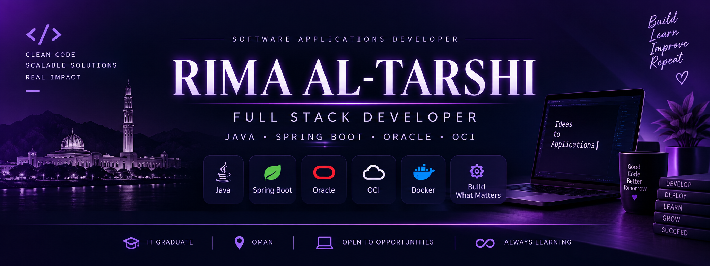

  

 

<h1 align="center">Hi 👋, I'm Rima Al-Tarshi</h1>

<h3 align="center">
  💜 Software Applications Developer | Full Stack Developer
</h3>

  

  

  

  

  

---

<!-- ===================== ABOUT ===================== -->

## 👩‍💻 About Me

I'm a **Software Applications Development graduate** and **Full Stack Developer** passionate about transforming ideas into secure, scalable, and user-focused applications.

- ☕ Building backend applications with **Java & Spring Boot**
- 🔗 Designing and integrating **RESTful APIs**
- 🗄️ Working with **Oracle SQL & PostgreSQL**
- ⚡ Developing database-driven applications with **Oracle APEX**
- ☁️ Working with **Oracle Cloud Infrastructure (OCI)**
- 🐳 Containerizing and deploying applications using **Docker**
- 🐧 Working with **Linux & cloud deployment environments**
- 🔐 Experience with **OAuth 2.0 & application security**
- 🌱 Continuously learning new **Full Stack & Cloud technologies**
- 💼 Open to **Full-Time Opportunities & Freelance Projects**

---

<!-- ===================== TECH STACK ===================== -->

## 🛠️ Tech Stack

<h3>☕ Backend Development</h3>

  

`Java` • `Spring Boot` • `REST APIs` • `Maven`

<h3>🎨 Frontend Development</h3>

  

`HTML` • `CSS` • `JavaScript`

<h3>🗄️ Database & Low-Code</h3>

  
  &nbsp;
  
  

`Oracle SQL` • `PostgreSQL` • `Oracle APEX`

<h3>☁️ Cloud & DevOps</h3>

  
  &nbsp;
  

`Docker` • `Docker Compose` • `Oracle Cloud Infrastructure` • `Linux` • `Git` • `GitHub`

<h3>🔧 Development Tools</h3>

  

`IntelliJ IDEA` • `Postman`

---

<!-- ===================== PROJECTS ===================== -->

## 🚀 Featured Projects

### 🏢 Leave Portal Application

> A cloud-integrated Spring Boot application for managing employee leave requests, document processing, authentication, and secure file storage.

**Key Features**

- Employee leave request management
- Document upload & processing
- Leave categorization
- OAuth 2.0 authentication
- OCI Object Storage integration
- REST API architecture

**Tech Stack**

`Java` `Spring Boot` `REST API` `Oracle` `OCI Object Storage` `OAuth 2.0`

🔗 [Explore Project](https://github.com/RimaAhmed1/leave-portal-app)

---

### 📅 Event Management System

> A full-stack event management application for creating, managing, and displaying events with secure authentication and cloud deployment.

**Key Features**

- Event creation & management
- Google OAuth 2.0 authentication
- Oracle Database integration
- RESTful backend
- OCI Compute deployment

**Tech Stack**

`Java` `Spring Boot` `Oracle` `OAuth 2.0` `REST API` `OCI`

---

### 🎫 Help Desk Ticketing System

> A ticket management application designed to organize support requests and improve issue tracking.

**Key Features**

- Ticket creation & management
- User and agent management
- Ticket priorities & statuses
- SLA rules
- Ticket comments
- Status history tracking

**Tech Stack**

`Java` `Spring Boot` `REST API` `Oracle` `PostgreSQL`

---

### 🐳 Spring Boot Docker Project

> A containerized Spring Boot application demonstrating Docker, persistent file storage, health checks, and multi-container architecture.

**Key Features**

- Spring Boot health-check API
- File upload endpoint
- Docker containerization
- Persistent Docker volumes
- Docker Compose
- Database container integration

**Tech Stack**

`Java` `Spring Boot` `Docker` `Docker Compose` `REST API`

---

## 🐍 Contribution Activity

  <picture>
    <source
      media="(prefers-color-scheme: dark)"
      srcset="https://raw.githubusercontent.com/RimaAhmed1/RimaAhmed1/gh-pages/github-contribution-grid-snake-dark.svg"
    />
    <source
      media="(prefers-color-scheme: light)"
      srcset="https://raw.githubusercontent.com/RimaAhmed1/RimaAhmed1/gh-pages/github-contribution-grid-snake.svg"
    />
    
  </picture>

<!-- ===================== CURRENT FOCUS ===================== -->

## 🎯 Currently Focused On

`☕ Java` &nbsp;&nbsp;
`🌱 Spring Boot` &nbsp;&nbsp;
`🔗 REST APIs` &nbsp;&nbsp;
`⚡ Oracle APEX` &nbsp;&nbsp;
`🐳 Docker` &nbsp;&nbsp;
`☁️ OCI`

---

<!-- ===================== CONNECT ===================== -->

## 🤝 Let's Connect

  I'm always interested in connecting, collaborating, and exploring new opportunities.

  

  

  

---

  <b>💜 Code. Learn. Build. Improve. 🚀</b>

  <i>Thanks for visiting my profile!</i>

